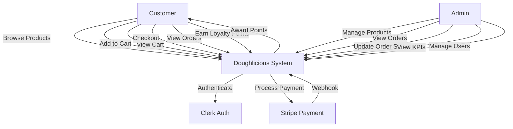
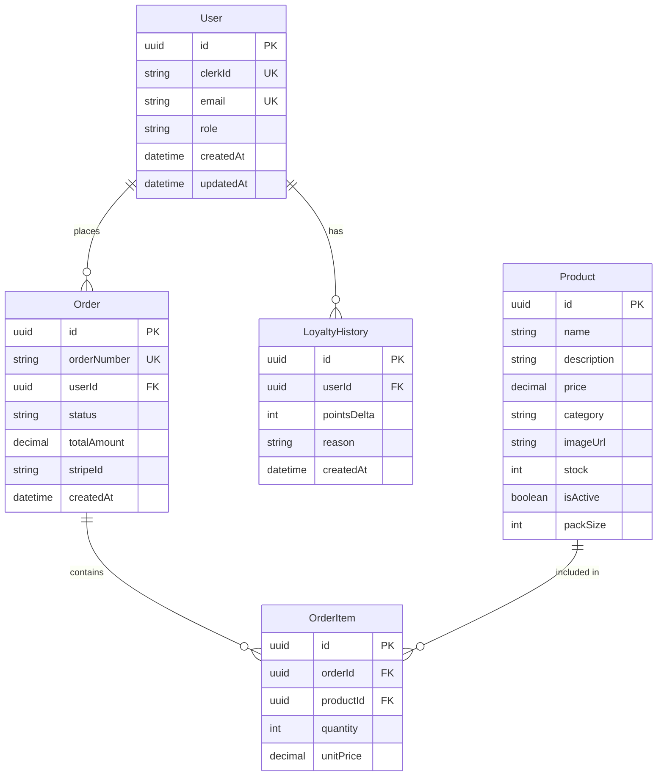
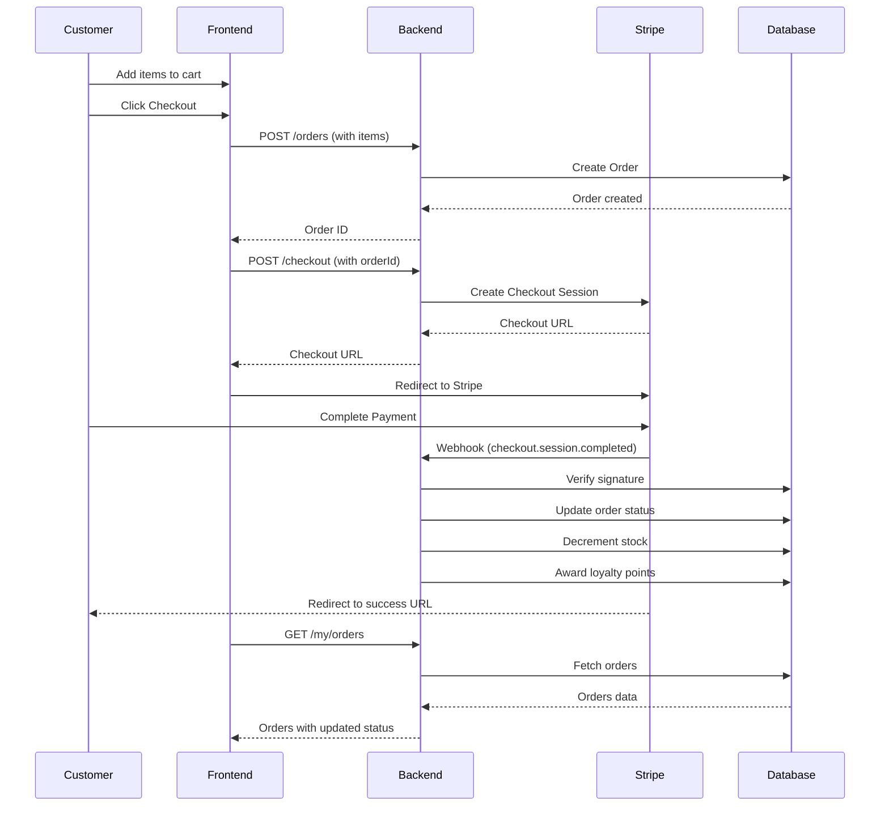
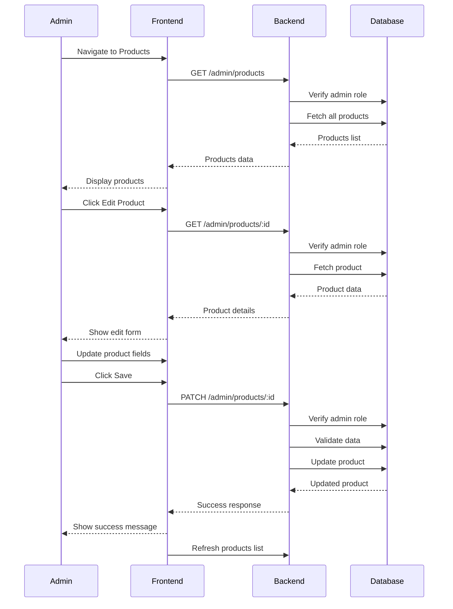
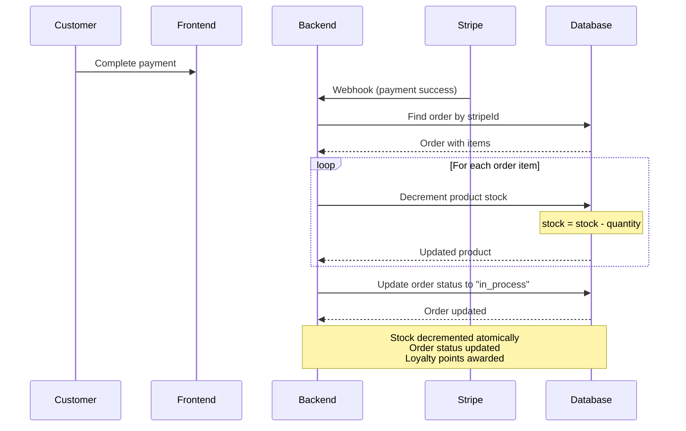
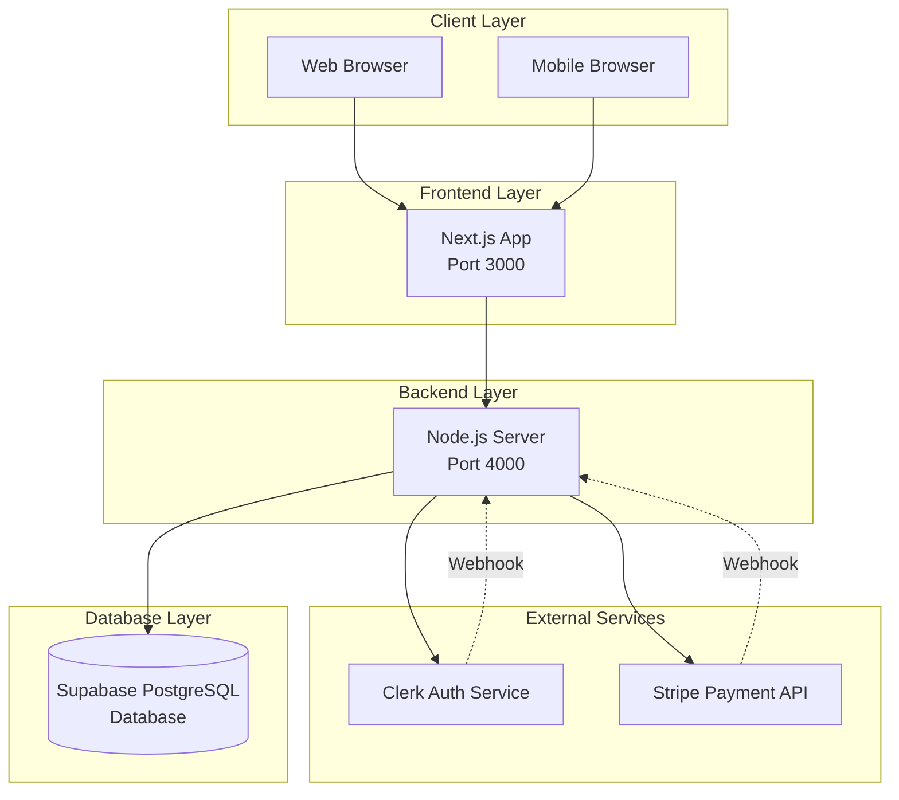

# Doughlicious Information Systems Project - Code Snippets and Wireframes

## Table of Contents

1. [Project File Map](#section-1--file-map)
2. [Code Snippets](#section-2--code-snippets)
   - 2.1 [Prisma Models](#21-prisma-models)
   - 2.2 [SQL Table Structures](#22-sql-table-structures)
   - 2.3 [API Routes](#23-api-routes)
   - 2.4 [Auth / Clerk Token Verification](#24-auth--clerk-token-verification)
   - 2.5 [RLS / Security Snippets](#25-rls--security-snippets)
   - 2.6 [Stripe Webhook](#26-stripe-webhook)
   - 2.7 [Checkout Session Creation](#27-checkout-session-creation)
   - 2.8 [Frontend Components](#28-frontend-components)
   - 2.9 [Error Handling Logic](#29-error-handling-logic)
3. [MermaidJS Diagrams](#section-3--mermaidjs-diagrams)
   - 3.1 [Wireframes](#31-wireframes)
   - 3.2 [System Diagrams](#32-system-diagrams)
4. [Summary Notes for Academic Use](#section-4--summary-notes-for-academic-use)

---

## Section 1 – File Map

### Project Structure

```
Doughlicious/
├── backend/
│   ├── src/
│   │   ├── api/
│   │   │   ├── auth.ts
│   │   │   ├── checkout.ts
│   │   │   ├── kpis.ts
│   │   │   ├── my.ts
│   │   │   ├── orders.ts
│   │   │   ├── products.ts
│   │   │   ├── users.ts
│   │   │   ├── webhook.clerk.ts
│   │   │   └── webhook.stripe.ts
│   │   ├── db/
│   │   │   ├── client.ts
│   │   │   ├── prisma.schema
│   │   │   ├── seed.ts
│   │   │   └── supabase.sql
│   │   ├── lib/
│   │   │   ├── env.ts
│   │   │   ├── logger.ts
│   │   │   ├── supabase.ts
│   │   │   ├── utils.ts
│   │   │   └── validation.ts
│   │   ├── services/
│   │   │   ├── auth.service.ts
│   │   │   ├── loyalty.service.ts
│   │   │   ├── order.service.ts
│   │   │   ├── payment.service.ts
│   │   │   └── product.service.ts
│   │   └── server.ts
│   ├── package.json
│   └── tsconfig.json
├── frontend/
│   ├── app/
│   │   ├── account/
│   │   │   ├── layout.tsx
│   │   │   └── page.tsx
│   │   ├── auth/
│   │   │   └── page.tsx
│   │   ├── cart/
│   │   │   └── page.tsx
│   │   ├── dashboard/
│   │   │   ├── inventory/
│   │   │   │   └── page.tsx
│   │   │   ├── orders/
│   │   │   │   └── page.tsx
│   │   │   ├── products/
│   │   │   │   ├── [id]/
│   │   │   │   │   └── edit/
│   │   │   │   │       └── page.tsx
│   │   │   │   ├── new/
│   │   │   │   │   └── page.tsx
│   │   │   │   └── page.tsx
│   │   │   ├── users/
│   │   │   │   └── page.tsx
│   │   │   ├── layout.tsx
│   │   │   └── page.tsx
│   │   ├── menu/
│   │   │   ├── loading.tsx
│   │   │   └── page.tsx
│   │   ├── product/
│   │   │   └── [id]/
│   │   │       └── page.tsx
│   │   ├── sign-in/
│   │   │   └── page.tsx
│   │   ├── sign-up/
│   │   │   └── page.tsx
│   │   └── layout.tsx
│   ├── components/
│   │   ├── admin/
│   │   │   ├── AdminProductRow.tsx
│   │   │   └── OrderReceipt.tsx
│   │   ├── dashboard/
│   │   │   ├── DashboardBreadcrumb.tsx
│   │   │   └── DashboardNav.tsx
│   │   ├── shared/
│   │   │   ├── FlavorSelectionModal.tsx
│   │   │   ├── MiniCartPopup.tsx
│   │   │   ├── NavBar.tsx
│   │   │   ├── ProductCard.tsx
│   │   │   └── ...
│   │   └── ui/
│   │       ├── button.tsx
│   │       ├── card.tsx
│   │       ├── table.tsx
│   │       └── ...
│   ├── hooks/
│   │   ├── useAuth.ts
│   │   ├── useCart.tsx
│   │   └── useNotifications.tsx
│   ├── lib/
│   │   ├── frontend-utils.ts
│   │   ├── servercomms.ts
│   │   └── utils.ts
│   ├── types/
│   │   └── index.ts
│   └── package.json
└── Database.sql
```

---

## Section 2 – Code Snippets

### 2.1 Prisma Models

**File:** `backend/src/db/prisma.schema`

```prisma
generator client {
  provider = "prisma-client-js"
}

datasource db {
  provider = "postgresql"
  url      = env("DATABASE_URL")
}

model User {
  id        String   @id @default(uuid())
  clerkId   String   @unique
  email     String   @unique
  role      String
  createdAt DateTime @default(now())
  updatedAt DateTime @updatedAt
  orders    Order[]
  loyalty   LoyaltyHistory[]
}

model Product {
  id          String  @id @default(uuid())
  name        String
  description String
  price       Decimal @db.Decimal(10,2)
  category    String
  imageUrl    String?
  stock       Int
  isActive    Boolean @default(true)
  packSize    Int?    @default(1)
  items       OrderItem[]
}

model Order {
  id          String   @id @default(uuid())
  orderNumber String?  @unique
  userId      String
  status      String
  totalAmount Decimal  @db.Decimal(10,2)
  stripeId    String?
  createdAt   DateTime @default(now())
  user        User     @relation(fields: [userId], references: [id])
  items       OrderItem[]
}

model OrderItem {
  id        String  @id @default(uuid())
  orderId   String
  productId String
  quantity  Int
  unitPrice Decimal @db.Decimal(10,2)
  order     Order   @relation(fields: [orderId], references: [id])
  product   Product @relation(fields: [productId], references: [id])
}

model LoyaltyHistory {
  id          String   @id @default(uuid())
  userId      String
  pointsDelta Int
  reason      String
  createdAt   DateTime @default(now())
  user        User     @relation(fields: [userId], references: [id])
}
```

### 2.2 SQL Table Structures

**File:** `Database.sql`

```sql
CREATE TABLE public.User (
  id uuid NOT NULL DEFAULT gen_random_uuid(),
  clerkId text NOT NULL UNIQUE,
  email text NOT NULL UNIQUE,
  role text NOT NULL CHECK (role = ANY (ARRAY['customer'::text, 'admin'::text])),
  createdAt timestamp with time zone NOT NULL DEFAULT now(),
  updatedAt timestamp with time zone NOT NULL DEFAULT now(),
  CONSTRAINT User_pkey PRIMARY KEY (id)
);

CREATE TABLE public.Product (
  id uuid NOT NULL DEFAULT gen_random_uuid(),
  name text NOT NULL,
  description text NOT NULL,
  price numeric NOT NULL,
  category text NOT NULL,
  imageUrl text NOT NULL,
  stock integer NOT NULL DEFAULT 0,
  isActive boolean NOT NULL DEFAULT true,
  packSize integer DEFAULT 1,
  CONSTRAINT Product_pkey PRIMARY KEY (id)
);

CREATE TABLE public.Order (
  id uuid NOT NULL DEFAULT gen_random_uuid(),
  userId uuid NOT NULL,
  status text NOT NULL,
  totalAmount numeric NOT NULL,
  stripeId text,
  createdAt timestamp with time zone NOT NULL DEFAULT now(),
  orderNumber text,
  CONSTRAINT Order_pkey PRIMARY KEY (id),
  CONSTRAINT Order_userId_fkey FOREIGN KEY (userId) REFERENCES public.User(id)
);

CREATE TABLE public.OrderItem (
  id uuid NOT NULL DEFAULT gen_random_uuid(),
  orderId uuid NOT NULL,
  productId uuid NOT NULL,
  quantity integer NOT NULL,
  unitPrice numeric NOT NULL,
  CONSTRAINT OrderItem_pkey PRIMARY KEY (id),
  CONSTRAINT OrderItem_orderId_fkey FOREIGN KEY (orderId) REFERENCES public.Order(id),
  CONSTRAINT OrderItem_productId_fkey FOREIGN KEY (productId) REFERENCES public.Product(id)
);

CREATE TABLE public.LoyaltyHistory (
  id uuid NOT NULL DEFAULT gen_random_uuid(),
  userId uuid NOT NULL,
  pointsDelta integer NOT NULL,
  reason text NOT NULL,
  createdAt timestamp with time zone NOT NULL DEFAULT now(),
  CONSTRAINT LoyaltyHistory_pkey PRIMARY KEY (id),
  CONSTRAINT LoyaltyHistory_userId_fkey FOREIGN KEY (userId) REFERENCES public.User(id)
);
```

### 2.3 API Routes

#### Products API

**File:** `backend/src/api/products.ts`

```typescript
import { ProductsService } from "../services/product.service"
import { prisma } from "../db/client"
import { ProductCreateSchema, ProductUpdateSchema } from "../lib/validation"
import { validateSession } from "../services/auth.service"

export async function getProducts(sessionToken: string) {
  const products = await ProductsService.getAll()
  return { data: products }
}

export async function getAdminProducts(sessionToken: string) {
  const user = await validateSession(sessionToken)
  if (user.role !== "admin") throw new Error("Forbidden")
  const products = await ProductsService.getAllAdmin()
  return { data: products }
}

export async function getProduct(sessionToken: string, id: string) {
  const p = await prisma.product.findUnique({ where: { id } })
  if (!p || (!p.isActive)) throw new Error("NotFound")
  return { data: { id: p.id, name: p.name, description: p.description, price: Number(p.price), category: p.category, imageUrl: p.imageUrl, stock: p.stock, isActive: p.isActive, packSize: p.packSize } }
}

export async function createProduct(sessionToken: string, payload: unknown) {
  const user = await validateSession(sessionToken)
  if (user.role !== "admin") throw new Error("Forbidden")
  const data = ProductCreateSchema.parse(payload)
  const product = await prisma.product.create({ data })
  return { data: product }
}

export async function updateProduct(sessionToken: string, id: string, payload: unknown) {
  const user = await validateSession(sessionToken)
  if (user.role !== "admin") throw new Error("Forbidden")
  const data = ProductUpdateSchema.parse(payload)
  const product = await prisma.product.update({ where: { id }, data })
  return { data: product }
}

export async function deleteProduct(sessionToken: string, id: string) {
  const user = await validateSession(sessionToken)
  if (user.role !== "admin") throw new Error("Forbidden")
  await prisma.product.delete({ where: { id } })
  return { ok: true }
}
```

#### Orders API

**File:** `backend/src/api/orders.ts`

```typescript
import { validateSession } from "../services/auth.service"
import { OrdersService } from "../services/order.service"
import { prisma } from "../db/client"

export async function createOrder(sessionToken: string, payload: { items: Array<{ productId: string; quantity: number }> }) {
  const user = await validateSession(sessionToken)
  const order = await OrdersService.createOrder(user, payload)
  return { data: order }
}

export async function listOrders(sessionToken: string) {
  const user = await validateSession(sessionToken)
  if (user.role !== "admin") throw new Error("Forbidden")
  const orders = await prisma.order.findMany({ include: { items: true, user: true }, orderBy: { createdAt: "desc" } })
  return {
    data: orders.map(o => ({
      id: o.id,
      orderNumber: o.orderNumber,
      email: o.user.email,
      status: o.status,
      totalAmount: Number(o.totalAmount),
      itemCount: o.items.length,
      createdAt: o.createdAt
    }))
  }
}

export async function listMyOrders(sessionToken: string) {
  const user = await validateSession(sessionToken)
  const orders = await prisma.order.findMany({ where: { userId: user.id }, include: { items: true }, orderBy: { createdAt: "desc" } })
  return {
    data: orders.map(o => ({
      id: o.id,
      orderNumber: o.orderNumber,
      status: o.status,
      totalAmount: Number(o.totalAmount),
      itemCount: o.items.length,
      createdAt: o.createdAt
    }))
  }
}

export async function updateOrder(sessionToken: string, orderId: string, payload: { status: string }) {
  const user = await validateSession(sessionToken)
  if (user.role !== "admin") throw new Error("Forbidden")
  const order = await prisma.order.update({ where: { id: orderId }, data: { status: payload.status } })
  return { data: order }
}
```

#### KPIs API

**File:** `backend/src/api/kpis.ts`

```typescript
import { validateSession } from "../services/auth.service"
import { prisma } from "../db/client"

export async function kpis(sessionToken: string) {
  const user = await validateSession(sessionToken)
  if (user.role !== "admin") throw new Error("Forbidden")
  const [ordersCount, revenueAgg, lowStockCount, activeProducts] = await Promise.all([
    prisma.order.count(),
    prisma.order.aggregate({ _sum: { totalAmount: true } }),
    prisma.product.count({ where: { stock: { lt: 10 }, isActive: true } }),
    prisma.product.count({ where: { isActive: true } })
  ])
  return { data: { ordersCount, revenue: Number(revenueAgg._sum.totalAmount ?? 0), lowStockCount, activeProducts } }
}
```

### 2.4 Auth / Clerk Token Verification

**File:** `backend/src/services/auth.service.ts`

```typescript
import { SessionTokenSchema } from "../lib/validation"
import { verifyToken, createClerkClient } from "@clerk/backend"
import { ENV } from "../lib/env"
import { prisma } from "../db/client"

export type Role = "customer" | "admin"
export type User = { id: string; clerkId: string; email: string; role: Role }

export async function validateSession(sessionToken: string): Promise<User> {
  if (!sessionToken || sessionToken.trim() === "") {
    throw new Error("Missing or empty session token")
  }
  
  SessionTokenSchema.parse(sessionToken)
  
  let verified
  try {
    verified = await verifyToken(sessionToken, { 
      secretKey: ENV.CLERK_SECRET_KEY() 
    })
  } catch (error: any) {
    throw new Error(`Token verification failed: ${error.message || "Invalid token"}`)
  }
  
  if (!verified) {
    throw new Error("Token verification returned null or undefined")
  }
  
  const payload = verified
  const clerkId = payload.sub as string
  
  if (!clerkId || typeof clerkId !== 'string') {
    throw new Error("Token payload 'sub' (user ID) is invalid or not a string")
  }
  
  const tokenEmail = (payload.email as string) || ""
  const clerkRole = (payload.publicMetadata?.role as Role) || "customer"

  let user = await prisma.user.findUnique({ where: { clerkId } })
  if (!user) {
    // Create user if doesn't exist
    let email = tokenEmail
    if (!email || email.trim() === "" || email.includes("@temp.local")) {
      try {
        const clerk = createClerkClient({ secretKey: ENV.CLERK_SECRET_KEY() })
        const clerkUser = await clerk.users.getUser(clerkId)
        // Prioritize primary email or verified email
        if (clerkUser.primaryEmailAddressId) {
          const primaryEmail = clerkUser.emailAddresses.find(
            (e: any) => e.id === clerkUser.primaryEmailAddressId
          )
          if (primaryEmail) {
            email = primaryEmail.emailAddress
          }
        }
      } catch (error) {
        console.warn(`Failed to fetch user from Clerk API for ${clerkId}:`, error)
        email = `user_${clerkId.slice(0, 8)}@temp.local`
      }
    }
    
    user = await prisma.user.create({ 
      data: { 
        clerkId, 
        email, 
        role: clerkRole 
      } 
    })
  } else {
    // Update existing user if needed
    const finalRole = user.role === "admin" ? "admin" : clerkRole
    if (user.role !== finalRole) {
      user = await prisma.user.update({
        where: { clerkId },
        data: { role: finalRole }
      })
    }
  }
  
  return { id: user.id, clerkId: user.clerkId, email: user.email, role: user.role as Role }
}
```

### 2.5 RLS / Security Snippets

**File:** `backend/src/db/supabase.sql`

```sql
-- Enable Row Level Security
alter table "User" enable row level security;
alter table "Product" enable row level security;
alter table "Order" enable row level security;
alter table "OrderItem" enable row level security;
alter table "LoyaltyHistory" enable row level security;

-- Helper functions
create or replace function current_clerk_id() returns text language sql stable as $$
  select coalesce(((current_setting('request.jwt.claims', true))::jsonb ->> 'sub'), null)
$$;

create or replace function current_is_admin() returns boolean language sql stable as $$
  select exists (
    select 1 from "User" u where u."clerkId" = current_clerk_id() and u."role" = 'admin'
  )
$$;

-- User policies
drop policy if exists users_select_self_or_admin on "User";
create policy users_select_self_or_admin on "User"
  for select using (current_is_admin() or "clerkId" = current_clerk_id());

drop policy if exists users_insert_admin on "User";
create policy users_insert_admin on "User"
  for insert with check (current_is_admin());

drop policy if exists users_update_admin on "User";
create policy users_update_admin on "User"
  for update using (current_is_admin()) with check (current_is_admin());

-- Product policies
drop policy if exists products_select_public_or_admin on "Product";
create policy products_select_public_or_admin on "Product"
  for select using (current_is_admin() or "isActive" = true);

drop policy if exists products_write_admin on "Product";
create policy products_write_admin on "Product"
  for insert with check (current_is_admin());

-- Order policies
drop policy if exists orders_select_owner_or_admin on "Order";
create policy orders_select_owner_or_admin on "Order"
  for select using (
    current_is_admin() or exists(
      select 1 from "User" u where u."id" = "Order"."userId" and u."clerkId" = current_clerk_id()
    )
  );

drop policy if exists orders_insert_owner_or_admin on "Order";
create policy orders_insert_owner_or_admin on "Order"
  for insert with check (
    current_is_admin() or exists(
      select 1 from "User" u where u."id" = "Order"."userId" and u."clerkId" = current_clerk_id()
    )
  );

drop policy if exists orders_update_admin on "Order";
create policy orders_update_admin on "Order"
  for update using (current_is_admin()) with check (current_is_admin());
```

### 2.6 Stripe Webhook

**File:** `backend/src/api/webhook.stripe.ts`

```typescript
import Stripe from "stripe"
import { ENV } from "../lib/env"
import { prisma } from "../db/client"
import { OrdersService } from "../services/order.service"
import { LoyaltyService } from "../services/loyalty.service"

const stripe = new Stripe(ENV.STRIPE_SECRET_KEY())

export async function handleStripeWebhook(rawBody: string, signature: string) {
  const secret = process.env.STRIPE_WEBHOOK_SECRET as string
  const event = stripe.webhooks.constructEvent(rawBody, signature, secret)
  
  // Handle successful payment
  if (event.type === "checkout.session.completed") {
    const session = event.data.object as Stripe.Checkout.Session
    
    // Verify payment was actually successful
    if (session.payment_status !== "paid") {
      console.warn(`Checkout session ${session.id} completed but payment_status is ${session.payment_status}`)
      return { ok: true }
    }
    
    // Find order by stripeId or metadata.orderId
    let order = await prisma.order.findFirst({ 
      where: { stripeId: session.id }, 
      include: { items: true } 
    })
    
    if (!order && session.metadata?.orderId) {
      order = await prisma.order.findUnique({ 
        where: { id: session.metadata.orderId }, 
        include: { items: true } 
      })
    }
    
    if (order) {
      // Award loyalty points
      const user = await prisma.user.findUnique({ where: { id: order.userId } })
      if (user) {
        const orderNumber = order.orderNumber || order.id.substring(0, 8)
        const existingAward = await prisma.loyaltyHistory.findFirst({
          where: {
            userId: user.id,
            reason: { contains: `Order #${orderNumber}` }
          }
        })
        
        if (!existingAward) {
          const points = Math.floor(Number(order.totalAmount))
          if (points > 0) {
            await LoyaltyService.award(
              { id: user.id, clerkId: user.clerkId, email: user.email, role: user.role as any }, 
              points, 
              `Order #${orderNumber} - ${points} Dough earned`
            )
          }
        }
      }
      
      // Update order status and stock
      if (order.status === "pending" || order.status === "created") {
        await OrdersService.markPaid(order.id)
        
        // Update stock
        for (const item of order.items) {
          await prisma.product.update({ 
            where: { id: item.productId }, 
            data: { stock: { decrement: item.quantity } } 
          })
        }
      }
    }
  }
  
  // Handle failed payment
  if (event.type === "checkout.session.async_payment_failed") {
    const session = event.data.object as Stripe.Checkout.Session
    let order = await prisma.order.findFirst({ 
      where: { stripeId: session.id } 
    })
    
    if (!order && session.metadata?.orderId) {
      order = await prisma.order.findUnique({ 
        where: { id: session.metadata.orderId } 
      })
    }
    
    if (order && (order.status === "pending" || order.status === "created")) {
      await OrdersService.cancelOrder(order.id, "Payment method failed")
    }
  }
  
  return { ok: true }
}
```

### 2.7 Checkout Session Creation

**File:** `backend/src/services/payment.service.ts`

```typescript
import type { User } from "./auth.service"
import Stripe from "stripe"
import { ENV } from "../lib/env"
import { prisma } from "../db/client"
import { createClerkClient } from "@clerk/backend"

export const PaymentService = {
  async startCheckout(user: User, payload: { orderId: string }): Promise<{ url: string; sessionId: string }> {
    const stripe = new Stripe(ENV.STRIPE_SECRET_KEY())
    const order = await prisma.order.findUnique({ 
      where: { id: payload.orderId }, 
      include: { items: { include: { product: true } } } 
    })
    
    if (!order) throw new Error("OrderNotFound")
    if (order.userId !== user.id) throw new Error("Forbidden")

    const line_items = order.items.map(i => ({
      price_data: {
        currency: "gbp",
        product_data: {
          name: i.product.name,
          description: i.product.description || undefined,
        },
        unit_amount: Math.round(Number(i.unitPrice) * 100)
      },
      quantity: i.quantity
    }))

    const idempotencyKey = `checkout_${order.id}_${user.id}`

    // Get email from database user
    let customerEmail = user.email
    if (!customerEmail || customerEmail.trim() === "") {
      const dbUser = await prisma.user.findUnique({ where: { id: user.id } })
      if (dbUser && dbUser.email) {
        customerEmail = dbUser.email
      }
    }

    // Get user name from Clerk
    let customerName = ""
    try {
      const clerk = createClerkClient({ secretKey: ENV.CLERK_SECRET_KEY() })
      const clerkUser = await clerk.users.getUser(user.clerkId)
      if (clerkUser.firstName || clerkUser.lastName) {
        customerName = [clerkUser.firstName, clerkUser.lastName].filter(Boolean).join(" ").trim()
      }
    } catch (error) {
      console.warn("Failed to fetch user name from Clerk:", error)
    }

    const sessionConfig: Stripe.Checkout.SessionCreateParams = {
      mode: "payment",
      line_items,
      metadata: {
        orderId: order.id,
        userId: user.id,
      },
      success_url: `${process.env.SUCCESS_URL ?? "http://localhost:3000/cart?success=true"}`,
      cancel_url: `${process.env.CANCEL_URL ?? "http://localhost:3000/cart?canceled=true"}`,
      billing_address_collection: "auto" as const,
      customer_email: customerEmail && customerEmail.trim() !== "" ? customerEmail : undefined,
    }

    if (customerName) {
      sessionConfig.metadata = {
        ...sessionConfig.metadata,
        customerName: customerName,
      }
    }

    const session = await stripe.checkout.sessions.create(sessionConfig, { idempotencyKey })

    await prisma.order.update({ 
      where: { id: order.id }, 
      data: { stripeId: session.id, status: "pending" } 
    })

    if (!session.url) {
      throw new Error("Stripe session URL not generated")
    }

    return { url: session.url, sessionId: session.id }
  }
}
```

### 2.8 Frontend Components

#### Product Listing Page

**File:** `frontend/app/menu/page.tsx`

```typescript
async function ProductsList() {
  const res = await serverComms("products")
  
  if (res.error) {
    return (
      <div className="text-center py-20">
        <div className="bg-destructive/10 border border-destructive/20 rounded-lg p-8 max-w-md mx-auto">
          <AlertCircle className="h-12 w-12 text-destructive mx-auto mb-4" />
          <h2 className="text-xl font-semibold text-destructive mb-2">Unable to Load Products</h2>
          <p className="text-muted-foreground mb-4">{res.error}</p>
          <RetryButton />
        </div>
      </div>
    )
  }

  const products: Product[] = res.data ?? []

  return (
    <div className="grid grid-cols-1 sm:grid-cols-2 lg:grid-cols-3 xl:grid-cols-4 gap-6">
      {products.map(p => (
        <ProductCard key={p.id} product={p} />
      ))}
    </div>
  )
}
```

#### Cart Page

**File:** `frontend/app/cart/page.tsx` (Excerpt)

```typescript
async function checkout() {
  if (!isSignedIn || !user) {
    window.location.href = "/auth?redirect=/cart"
    return
  }
  
  setLoading(true)
  try {
    const token = await getToken()
    if (!token) {
      window.location.href = "/auth"
      return
    }
    
    // Transform cart items to backend format
    const orderItems = items.map(item => ({
      productId: item.id,
      quantity: item.quantity
    }))
    
    // Create order
    const orderRes = await serverComms("orders", { 
      method: "POST", 
      data: { items: orderItems }, 
      headers: { Authorization: `Bearer ${token}` } 
    })
    
    if (orderRes.error) {
      alert(`Failed to create order: ${orderRes.error}`)
      return
    }
    
    const orderId = orderRes?.data?.id
    if (orderId) {
      // Create checkout session
      const checkoutRes = await serverComms("checkout", { 
        method: "POST", 
        data: { orderId }, 
        headers: { Authorization: `Bearer ${token}` } 
      })
      
      if (checkoutRes.error) {
        alert(`Failed to create checkout session: ${checkoutRes.error}`)
        return
      }
      
      const url = checkoutRes?.data?.url
      if (url) {
        window.location.href = url
      }
    }
  } catch (error) {
    console.error("Checkout failed", error)
    alert("An error occurred during checkout. Please try again.")
  } finally {
    setLoading(false)
  }
}
```

#### Dashboard Home Page

**File:** `frontend/app/dashboard/page.tsx` (Excerpt)

```typescript
export default function DashboardHomePage() {
  const { getToken, isLoaded, isSignedIn } = useAuth()
  const [role, setRole] = useState<string | null>(null)
  const [adminKpis, setAdminKpis] = useState({ 
    ordersCount: 0, 
    revenue: 0, 
    lowStockCount: 0, 
    activeProducts: 0 
  })

  useEffect(() => {
    async function fetchData() {
      if (!isSignedIn || !isLoaded) return
      try {
        const token = await getToken()
        if (!token) return

        const me = await serverComms("auth/me", { 
          headers: { Authorization: `Bearer ${token}` } 
        })
        const userRole = me?.data?.role as string
        setRole(userRole)

        if (userRole === "admin") {
          const k = await serverComms("admin/kpis", { 
            headers: { Authorization: `Bearer ${token}` } 
          })
          if (k.data) {
            setAdminKpis(k.data)
          }
        }
      } catch (error) {
        console.error("Failed to fetch dashboard data", error)
      }
    }
    if (isSignedIn && isLoaded) {
      fetchData()
      const interval = setInterval(() => {
        fetchData()
      }, 5000)
      return () => clearInterval(interval)
    }
  }, [isSignedIn, isLoaded, getToken])

  if (role === "admin") {
    return (
      <div className="space-y-4 md:space-y-6">
        <div className="grid grid-cols-1 sm:grid-cols-2 lg:grid-cols-4 gap-4 mb-6 md:mb-8">
          <Card>
            <CardHeader>
              <CardTitle>Orders</CardTitle>
              <CardDescription>Total orders</CardDescription>
            </CardHeader>
            <CardContent className="text-3xl font-semibold">{adminKpis.ordersCount}</CardContent>
          </Card>
          <Card>
            <CardHeader>
              <CardTitle>Revenue</CardTitle>
              <CardDescription>All-time</CardDescription>
            </CardHeader>
            <CardContent className="text-3xl font-semibold">{formatCurrency(adminKpis.revenue)}</CardContent>
          </Card>
          <Card>
            <CardHeader>
              <CardTitle>Active Products</CardTitle>
              <CardDescription>Visible in store</CardDescription>
            </CardHeader>
            <CardContent className="text-3xl font-semibold">{adminKpis.activeProducts}</CardContent>
          </Card>
          <Card>
            <CardHeader>
              <CardTitle>Low Stock</CardTitle>
              <CardDescription>&lt; 10 remaining</CardDescription>
            </CardHeader>
            <CardContent className="text-3xl font-semibold">{adminKpis.lowStockCount}</CardContent>
          </Card>
        </div>
      </div>
    )
  }
}
```

#### Product Edit Page

**File:** `frontend/app/dashboard/products/[id]/edit/page.tsx` (Excerpt)

```typescript
async function submit() {
  setSaving(true)
  const token = await getToken()
  if (!token) {
    toast({
      title: "Error",
      description: "Please sign in",
      variant: "destructive",
    })
    setSaving(false)
    return
  }
  try {
    const imageUrlValue = imagePreview || (form.imageUrl && form.imageUrl.trim() !== '' ? form.imageUrl : null)
    const submitData = {
      ...form,
      imageUrl: imageUrlValue || null,
    }
    
    const res = await serverComms(`admin/products/${id}`, { 
      method: "PATCH", 
      data: submitData, 
      headers: { Authorization: `Bearer ${token}` } 
    })
    
    if (res.error) {
      toast({
        title: "Error",
        description: res.error || "Failed to update product",
        variant: "destructive",
      })
    } else {
      toast({
        title: "Success",
        description: "Product updated successfully",
      })
      router.push("/dashboard/products")
    }
  } catch (error: any) {
    toast({
      title: "Error",
      description: "Failed to update product. Please try again.",
      variant: "destructive",
    })
  } finally {
    setSaving(false)
  }
}
```

### 2.9 Error Handling Logic

#### Auth Service Error Handling

**File:** `backend/src/services/auth.service.ts`

```typescript
export async function validateSession(sessionToken: string): Promise<User> {
  if (!sessionToken || sessionToken.trim() === "") {
    throw new Error("Missing or empty session token")
  }
  
  SessionTokenSchema.parse(sessionToken)
  
  let verified
  try {
    verified = await verifyToken(sessionToken, { 
      secretKey: ENV.CLERK_SECRET_KEY() 
    })
  } catch (error: any) {
    throw new Error(`Token verification failed: ${error.message || "Invalid token"}`)
  }
  
  if (!verified) {
    throw new Error("Token verification returned null or undefined")
  }
  
  const payload = verified
  if (!payload || typeof payload !== 'object' || !('sub' in payload)) {
    throw new Error(`Token payload missing 'sub' (user ID) property. Payload keys: ${JSON.stringify(Object.keys(payload || {}))}`)
  }
  
  const clerkId = payload.sub as string
  if (!clerkId || typeof clerkId !== 'string') {
    throw new Error("Token payload 'sub' (user ID) is invalid or not a string")
  }
  // ... rest of function
}
```

#### Server Error Handling

**File:** `backend/src/server.ts` (Excerpt)

```typescript
try {
  // Route handling logic
  if (url.pathname === "/products" && method === "GET") {
    const data = await ServerComms.getProducts(token ?? "")
    return sendJSON(200, { data })
  }
  // ... more routes
} catch (e: any) {
  console.error("[DEBUG] Server error:", e)
  sendJSON(400, { error: e.message ?? "Error" })
}
```

#### Frontend Error Handling

**File:** `frontend/app/cart/page.tsx` (Excerpt)

```typescript
try {
  const orderRes = await serverComms("orders", { 
    method: "POST", 
    data: { items: orderItems }, 
    headers: { Authorization: `Bearer ${token}` } 
  })
  
  if (orderRes.error) {
    console.error("Failed to create order:", orderRes.error)
    alert(`Failed to create order: ${orderRes.error}`)
    return
  }
  // ... continue processing
} catch (error) {
  console.error("Checkout failed", error)
  alert("An error occurred during checkout. Please try again.")
} finally {
  setLoading(false)
}
```

---

## Section 3 – MermaidJS Diagrams

### 3.1 Wireframes

#### Customer Menu Screen

```mermaid
wireframe
  CustomerMenuPage
    Header
      Logo
      Navigation
        Menu
        Cart
        Account
    Hero
      Title
      Description
    ProductGrid
      ProductCard
        Image
        Name
        Price
        AddToCart
      ProductCard
      ProductCard
      ProductCard
    Footer
```

#### Product Detail Page

```mermaid
wireframe
  ProductDetailPage
    Header
      BackButton
      Navigation
    MainContent
      LeftColumn
        ProductImage
        FeaturedBadge
      RightColumn
        CategoryBadge
        ProductName
        Price
        Description
        ProductDetails
        FlavorSelection
          Flavor1
          Flavor2
          Flavor3
        QuantitySelector
        AddToCartButton
        LoyaltyPoints
    FrequentlyBoughtTogether
      ProductCard
      ProductCard
      ProductCard
```

#### Cart & Checkout Page

```mermaid
wireframe
  CartPage
    Header
      Title
      Description
    CartContent
      LeftColumn
        CartItems
          CartItem
            Image
            Name
            Flavors
            Price
            QuantityControls
            RemoveButton
      RightColumn
        OrderSummary
          UserInfo
          Subtotal
          Delivery
          Total
          LoyaltyPoints
          CheckoutButton
    SuccessMessage
      OrderNumber
      Status
      LoyaltyPoints
      ActionButtons
```

#### Admin Dashboard Home

```mermaid
wireframe
  AdminDashboard
    Header
      Title
      LiveUpdatesBadge
    KPICards
      OrdersCard
      RevenueCard
      ActiveProductsCard
      LowStockCard
    Charts
      RevenueTrend
      OrdersTrend
    QuickLinks
      ManageProducts
      ManageOrders
      Inventory
      Users
```

#### Admin Product Edit Page

```mermaid
wireframe
  AdminProductEdit
    Header
      Title
      Description
    Form
      LeftColumn
        BasicInformation
          ProductName
          Description
          Category
      RightColumn
        PricingInventory
          Price
          PackSize
          Stock
          ActiveCheckbox
      ImageUpload
        ImagePreview
        UploadButton
        ImageURL
    Actions
      CancelButton
      SaveButton
```

### 3.2 System Diagrams

#### Use Case Diagram



#### ERD (Entity Relationship Diagram)



#### Payment Flow Sequence Diagram



#### Admin Update Flow



#### Inventory Transaction Flow



#### Deployment Diagram



---

## Section 4 – Summary Notes for Academic Use

### Prisma Models

The Prisma schema defines the data models for the Doughlicious e-commerce system. It establishes relationships between User, Product, Order, OrderItem, and LoyaltyHistory entities. The schema uses PostgreSQL as the database provider and includes constraints such as unique identifiers, foreign key relationships, and default values. The models support role-based access control through the User model's role field, which distinguishes between customers and administrators.

### SQL Table Structures

The SQL schema provides the actual database table definitions that correspond to the Prisma models. It includes CREATE TABLE statements with proper data types, constraints, and foreign key relationships. The schema enforces referential integrity through foreign key constraints and includes check constraints for role validation. Indexes are created for performance optimization on frequently queried fields.

### API Routes

The API routes implement RESTful endpoints for product management, order processing, and administrative functions. Each route includes authentication validation through the `validateSession` function, which verifies Clerk tokens. Admin-only routes check for the "admin" role before allowing access. The routes follow a consistent pattern of validating input, performing business logic through service layers, and returning structured JSON responses.

### Auth / Clerk Token Verification

The authentication service validates JWT tokens issued by Clerk, extracts user information from the token payload, and synchronizes user data with the database. It handles cases where users don't exist in the database by creating them on first authentication. The service prioritizes database-stored roles over Clerk metadata to prevent accidental role changes, ensuring admin privileges are preserved.

### RLS / Security Snippets

Row Level Security (RLS) policies enforce data access control at the database level. The policies use helper functions to identify the current user's Clerk ID and admin status. Users can only view their own orders and loyalty history, while admins have full access. Products are publicly readable if active, but only admins can modify them. This multi-layered security approach protects sensitive data even if application-level checks are bypassed.

### Stripe Webhook

The Stripe webhook handler validates webhook signatures to ensure requests originate from Stripe. It processes payment completion events by updating order status, decrementing inventory, and awarding loyalty points. The handler includes duplicate prevention logic to avoid crediting loyalty points multiple times for the same order. Failed payment events trigger order cancellation to maintain data consistency.

### Checkout Session Creation

The payment service creates Stripe Checkout sessions with line items derived from order data. It includes customer email and name from both the database and Clerk to pre-populate the checkout form. The service uses idempotency keys to prevent duplicate session creation. After creating the session, it updates the order with the Stripe session ID and sets the status to "pending" to track the payment state.

### Frontend Components

The frontend components implement the user interface using React and Next.js. The ProductCard component displays product information and handles add-to-cart functionality, with special handling for pack products that require flavor selection. The Cart page manages shopping cart state, calculates totals, and initiates the checkout process. The Dashboard provides role-based views: customers see their order history and loyalty points, while admins see KPIs, charts, and management interfaces.

### Error Handling Logic

Error handling is implemented at multiple levels. The authentication service throws descriptive errors for invalid tokens or missing user data. API routes catch errors and return appropriate HTTP status codes with error messages. Frontend components display user-friendly error messages and provide retry mechanisms. The server includes a global error handler that catches unhandled exceptions and returns generic error responses to prevent information leakage.

### System Architecture

The system follows a three-tier architecture: frontend (Next.js), backend (Node.js), and database (PostgreSQL via Supabase). External services (Clerk for authentication, Stripe for payments) integrate through webhooks and API calls. The architecture supports real-time updates through polling mechanisms in the frontend, ensuring users see the latest order status and inventory levels. The separation of concerns allows for independent scaling and maintenance of each layer.

---

**Document Generated:** Analysis of existing Doughlicious codebase for academic documentation purposes.  
**Note:** All code snippets and diagrams are based on actual implementation found in the repository.

